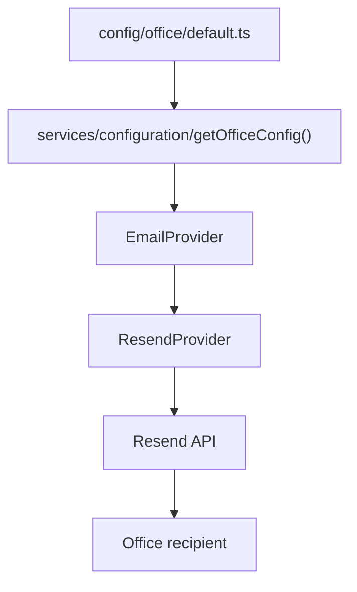

# Arquitetura

## Supabase

O Supabase será usado como banco de dados principal do Radar Previdenciário. A aplicação Next.js mantém integrações em `lib/supabase/`, com cliente público baseado em publishable/anon key e cliente administrativo exclusivo de servidor em `lib/supabase/admin.ts`.

A service role é usada somente em Server Actions e serviços server-only. Ela não deve ser importada por Client Components, não deve receber prefixo `NEXT_PUBLIC_` e nunca deve ser exposta em logs, bundle do navegador ou repositório.

## Brand Config System

A camada visual foi estruturada para SaaS multi-escritório. Dados institucionais, identidade visual, SEO e textos legais ficam centralizados em `config/`:

- `config/brand/`: nome, logo, contatos, redes sociais e dados institucionais.
- `config/theme/`: cores, fontes, radius, sombras, botões, cards e badges.
- `config/office/`: responsável técnico, OAB, especialidades, cidades, estados, atendimento e mensagem padrão.
- `config/seo/`: título, descrição, keywords, locale e imagens sociais.
- `config/legal/`: títulos legais, disclaimer e política de cookies.

Componentes de layout e UI consomem essas informações por meio de `services/configuration`. Para trocar o escritório exibido pela aplicação, a regra é alterar apenas os arquivos em `config/`, mantendo componentes sem dados institucionais hardcoded.

Os tokens de Tailwind usam CSS variables geradas a partir de `themeConfig` no layout raiz. Isso mantém dark mode e identidade visual editáveis sem reescrever classes de componentes.

## Configuration Service Layer

A aplicação usa uma camada intermediária para leitura de configurações. Componentes e páginas não importam arquivos `default.ts` diretamente, porque essa dependência criaria acoplamento com a origem local dos dados e dificultaria a futura evolução para SaaS multi-tenant.

Fluxo atual:

```text
Component/Page
    ↓
Configuration Service
    ↓
App Config Loader
    ↓
Local Config — MVP
    ↓
Supabase Config — Futuro
```

Responsabilidades:

- `config/loader.ts`: único ponto autorizado a importar os arquivos locais `default.ts`; valida a configuração completa com Zod e retorna `AppConfig`.
- `config/schemas.ts`: schemas Zod para `BrandConfig`, `OfficeConfig`, `ThemeConfig`, `SeoConfig`, `LegalConfig` e `AppConfig`.
- `services/configuration/getAppConfig.ts`: serviço de leitura da configuração completa.
- `services/configuration/getBrandConfig.ts`: retorna apenas a configuração de marca.
- `services/configuration/getOfficeConfig.ts`: retorna apenas a configuração institucional do escritório.
- `services/configuration/getThemeConfig.ts`: retorna apenas tokens visuais.
- `services/configuration/getSeoConfig.ts`: retorna apenas SEO.
- `services/configuration/getLegalConfig.ts`: retorna apenas textos legais.

No MVP, `loadAppConfig()` ainda delega para `loadLocalConfig()` para brand, office, theme, SEO e legal. O contrato aceita `ConfigurationContext` com tenant resolvido, e `getTrackingConfig()` já consulta `tenant_tracking_configs` quando há `tenantId`.

A resolução de tenant já segue a ordem:

```text
tenantId explícito
→ slug
→ hostname
→ fallback default em desenvolvimento/preview
```

Serviços principais:

- `services/tenants/resolveTenant.ts`
- `services/tenants/repository/`
- `lib/tenants/`
- `lib/security/tenant-secrets.ts`

Quando a aplicação evoluir para SaaS completo, brand, office, theme, SEO e legal poderão migrar para Supabase por tenant, adicionar cache seguro por tenant e manter os componentes visuais inalterados.

## Multi-Tenant Foundation

A migration `20260714150000_create_multi_tenant_foundation.sql` criou `tenants`, `tenant_domains`, `tenant_tracking_configs` e `tenant_secrets`.

Também adicionou `tenant_id` obrigatório às tabelas operacionais, com backfill para o tenant padrão `resende-advogados`.

Todo serviço server-only que lê ou grava dados de operação recebe ou resolve `tenantId` e filtra por `tenant_id`. Isso evita que `lead_id`, `session_id`, `result_id`, `event_id` ou `payload_hash` sejam usados isoladamente entre tenants.

Secrets por tenant são criptografados com AES-256-GCM no servidor e dependem de `TENANT_SECRETS_ENCRYPTION_KEY`. Tokens como Meta CAPI não devem ser gravados em `tenant_tracking_configs`.

Referência operacional completa: `docs/multi-tenant.md`.

## Lead Registration Flow

O primeiro fluxo funcional do MVP segue a cadeia:

```text
Client Form
    ↓
Server Action
    ↓
Validation
    ↓
Deduplication
    ↓
Supabase Admin
    ↓
leads
    ↓
tracking_events
    ↓
HTTP-only cookie
    ↓
/quiz
```

O formulário de `/cadastro` roda como Client Component para usar React Hook Form, validação Zod e estado de envio. A persistência acontece apenas em `app/cadastro/actions.ts`, evitando escrita direta no Supabase pelo navegador.

A Server Action valida o payload recebido, rejeita honeypot preenchido com mensagem genérica, normaliza nome, e-mail e telefone, extrai IP somente de headers do servidor, aplica rate limit best effort por IP e chama serviços server-only.

`services/leads/createLead.ts` usa o Supabase Admin Client para buscar leads recentes com o mesmo telefone normalizado nos últimos 15 minutos. Quando encontra registro recente, reutiliza o `leadId` sem sobrescrever dados anteriores. Essa deduplicação é proteção operacional, não regra definitiva de identidade.

Após criar ou reutilizar o lead, `services/tracking/trackEvent.ts` registra o evento interno `LeadSubmitted`. Se o tracking falhar, o lead não é removido e o usuário continua o fluxo; a conversão principal não depende de tracking secundário.

O `leadId` é preservado no cookie HTTP-only `rp_lead_session`, com `SameSite=Lax`, `Secure` em produção e duração de 2 horas. A rota `/quiz` verifica esse cookie no servidor e redireciona para `/cadastro` quando ausente. Nenhum dado pessoal é salvo em URL, cookie público ou `sessionStorage`.

## Modular Quiz Templates

O Radar Previdenciário agora trata o quiz como catálogo de templates
versionáveis. A plataforma qualifica o lead; o advogado analisa o caso.

Templates padrão:

- `/quiz`: triagem previdenciária geral.
- `/quiz/salario-maternidade`: salário-maternidade.
- `/quiz/fibromialgia`: tema relacionado à fibromialgia.
- `/quiz/depressao`: tema relacionado à depressão.
- `/quiz/autismo`: tema relacionado ao autismo.

Contratos principais:

- `QuizTemplateType`: `general`, `maternity`, `fibromyalgia`, `depression`, `autism`, `custom`.
- `QuizTemplateSource`: `platform` ou `tenant`.
- `QuizTemplateStatus`: `draft`, `active`, `inactive`, `archived`.
- `ownership`: `platform_managed` ou `tenant_managed`.

Templates `platform_managed` são mantidos centralmente. Templates
`tenant_managed` devem ser criados por clone, com registro de tenant, versão,
autor, conteúdo anterior/novo e status. Escritórios não editam diretamente
templates da plataforma.

Os templates ficam inicialmente em `config/quiz/templates/` e são resolvidos no
servidor por `services/quiz/templates`. A migration
`20260715120000_create_modular_quiz_templates.sql` prepara persistência em:

- `quiz_templates`;
- `quiz_template_questions`;
- `quiz_template_rules`;
- `quiz_template_versions`.

`quiz_sessions` passa a aceitar `quiz_template_id`, `quiz_template_version` e
`template_type`. Sessões antigas sem template usam fallback para o template
geral.

Conteúdo customizado passa por moderação automática com níveis `allowed`,
`warning` e `blocked`. Expressões como "benefício garantido", "causa ganha",
"será aprovado" e "chance de êxito" são bloqueadas ou sinalizadas quando não
aparecem em contexto neutro.

Permissões preparadas para o painel:

- `admin`: visualiza, clona, cria, edita template do tenant, publica, desativa e cria versão.
- `manager`: visualiza, clona, cria e edita draft.
- `agent`: visualiza templates ativos.
- `viewer`: somente leitura.

## Question Engine

A infraestrutura do quiz foi criada como um Question Engine configurável, sem arrays hardcoded dentro da tela e sem Rule Engine jurídico definitivo.

Camadas principais:

- `config/quiz/templates/`: templates versionáveis com perguntas, regras e textos públicos.
- `config/quiz/questions/`: definições legadas/versionadas de perguntas.
- `config/quiz/flows/`: fluxos com ordem de passos.
- `config/quiz/benefits/`: catálogo inicial de benefícios e contextos.
- `types/quiz/`: contratos `QuestionDefinition`, `BenefitDefinition`, `FlowDefinition` e tipos auxiliares.
- `services/quiz/engine/`: resolução de perguntas ativas e visibilidade.
- `services/quiz/navigation/`: cálculo de anterior, próximo e retomada.
- `services/quiz/progress/`: progresso real por perguntas obrigatórias respondidas.
- `services/quiz/session/`: criação/reuso de sessão e persistência server-only.
- `components/quiz/renderer/`: renderer por registro de componentes, sem switch gigante.
- `components/quiz/experience/`: experiência cliente com autosave e navegação.

Fluxo de execução:

```text
/quiz ou /quiz/[templateSlug]
    ↓
Cookie rp_lead_session
    ↓
Load lead
    ↓
Resolve tenant and quiz template on the server
    ↓
Create or reuse quiz_session for lead + template
    ↓
Load latest quiz_answers
    ↓
Resolve visible questions
    ↓
Resume first unanswered question
    ↓
QuestionRenderer
    ↓
Server Action saveQuizAnswerAction
    ↓
quiz_answers + tracking_events
```

O template geral identifica o assunto previdenciário e pode direcionar campanhas para templates temáticos. Os templates de saúde organizam impactos funcionais relatados, sem diagnóstico médico, sem avaliação de incapacidade e sem conclusão automática de direito.

Cada resposta é salva imediatamente em `quiz_answers`. Como a tabela atual não possui constraint única por pergunta/sessão, a camada de serviço aplica idempotência operacional: procura uma resposta existente para `session_id + question_id`, atualiza quando encontra e insere apenas na primeira resposta daquela pergunta. Isso evita duplicidade no fluxo atual sem alterar schema nesta etapa.

`QuizStarted` é registrado quando uma sessão aberta é criada. `QuestionAnswered` é registrado a cada resposta salva. `ResultGenerated` é registrado após o Rule Engine, Result Engine e a persistência de `quiz_results`. `QuizCompleted` é registrado quando a última pergunta do fluxo é salva, todas as obrigatórias estão respondidas e a sessão é concluída. `ResultViewed` é registrado na primeira visualização da página de resultado.

Para evitar duplicidade por requisições simultâneas na entrada do quiz, o template geral preserva compatibilidade com a sessão inicial do lead. Templates temáticos criam sessões independentes vinculadas ao template. Se uma sessão aberta já existir para o mesmo lead e template, o serviço reutiliza a sessão existente.

## Rule Engine e Result Engine

A etapa de resultado foi separada em camadas para manter o Question Engine focado apenas na coleta de respostas:

```text
Question Engine
    ↓
Rule Engine
    ↓
Result Engine
    ↓
Result Persistence
    ↓
/resultado
```

Responsabilidades:

- `config/quiz/rules/`: regras preliminares por benefício, sem acoplamento com componentes.
- `services/quiz/rules/`: avalia respostas salvas e gera candidatos por benefício.
- `services/quiz/results/resultEngine.ts`: calcula score, classificação e síntese informativa.
- `services/quiz/results/resultPersistence.ts`: grava ou atualiza `quiz_results` no Supabase usando service role somente no servidor.
- `services/quiz/results/resultTracking.ts`: registra `ResultGenerated` e `ResultViewed` com deduplicação em aplicação.
- `app/resultado/actions.ts` e `components/tracking/ResultViewedTracker.tsx`: disparam `ResultViewed` por Server Action após a página carregar, com cookie HTTP-only por resultado para evitar duplicidade em refresh.
- `app/resultado/page.tsx`: lê o último resultado do lead pelo cookie HTTP-only e exibe a resposta informativa.

As classificações atuais são `alto_potencial`, `medio_potencial` e `baixo_potencial`. Elas são internas e indicam prioridade operacional. A camada não implementa Rule Engine jurídico definitivo, cálculo previdenciário, IA ou recomendação vinculante.

Resultados internos preservam `classification`, `score`, `priority`, `topic`,
`dataCompleteness`, `missingCriticalAnswers`, `requiresHumanReview`,
`matchedRules` e `templateType`. Resultados públicos exibem somente título,
resumo, tema, próximo passo e disclaimer.

Quando a última pergunta obrigatória é salva, `saveQuizAnswerAction` avalia as regras, persiste o resultado por `upsert`, registra `ResultGenerated`, marca a sessão como `completed`, registra `QuizCompleted` com deduplicação por sessão e retorna o destino `/resultado` para o Client Component.

O banco remoto possui a constraint `quiz_results_session_id_unique`, criada após auditoria confirmar ausência de duplicidades em `quiz_results`. Essa constraint permite idempotência real para concorrência de dupla conclusão.

Durante a validação em produção, o tracking server-side direto no Server Component de `/resultado` duplicou `ResultViewed` em refreshes próximos. A correção foi mover esse evento para uma Server Action idempotente, mantendo o segredo no servidor e evitando repetição por cookie e consulta prévia em `tracking_events`.

## Lead Qualification Pipeline e Notification Engine

Ao concluir o quiz, o resultado preliminar alimenta uma pipeline separada da geração do resultado. Falhas de notificação não bloqueiam a experiência do usuário.

Fluxo atual:

```text
QuizCompleted
    ↓
Lead Qualification
    ↓
Notification Log
    ↓
Sync Notification Queue
    ↓
Email Provider
    ↓
Resend Provider
```

Identidade institucional de e-mail:



Camadas:

- `services/qualification/`: converte `classification` em prioridade, decisão de envio e providers.
- `services/notification/pipeline/`: orquestra lead, resultado, payload, hash e idempotência.
- `services/notification/queue/`: abstração de fila inicialmente síncrona, preparada para BullMQ, Redis, QStash ou Inngest.
- `services/notification/dispatcher/`: controla tentativas, retry, estados do log e tracking interno.
- `services/notification/providers/`: contratos e providers. `EmailProvider` encapsula `ResendProvider`, que consome `getOfficeConfig()` para remetente, reply-to e destinatário.
- `emails/templates/`: templates React Email para leads de alto e médio potencial.

Regras de qualificação:

- `alto_potencial`: notifica por e-mail, prioridade `high`.
- `medio_potencial`: notifica por e-mail, prioridade `medium`.
- `baixo_potencial`: não envia e registra `ignored`.

Responsabilidades do banco:

- `provider`: identifica canal futuro como `email`, `whatsapp`, `slack`, `discord`, `crm` ou `webhook`.
- `priority`: orienta ordenação futura de fila entre `low`, `medium`, `high` e `critical`.
- `attempt`: prepara retries sem criar novos registros para a mesma notificação.
- `payload_hash`: permite idempotência sem persistir payload completo ou PII.
- `queued_at`, `processing_started_at`, `sent_at`, `failed_at`: sustentam observabilidade do ciclo de entrega.
- `last_error`: passa a ser o campo preferencial para erro sanitizado, mantendo `error_message` por compatibilidade.

O índice único parcial em `provider + payload_hash` protege notificações ativas ou já enviadas contra duplicidade quando a camada de envio for criada. O schema mantém RLS ativa e não adiciona policies públicas; futuras escritas devem permanecer em serviços server-only.

Idempotência:

- o hash considera provider, destinatário, lead, resultado e template;
- `sent` nunca é reenviado;
- estados ativos não criam novo log;
- `failed` pode ser reutilizado para retry controlado;
- payload completo não é salvo em `notification_logs`.

Retry:

- erros temporários do provider usam status `retrying`;
- o limite atual é de 3 tentativas;
- o backoff é exponencial;
- erro final usa status `failed` e tracking `NotificationFailed`.

Segurança:

- `RESEND_API_KEY` só é lida em servidor;
- `OfficeConfig.email.notificationEmail` define o destinatário do escritório;
- `OfficeConfig.email.fromName` e `OfficeConfig.email.fromAddress` definem o remetente;
- `OfficeConfig.email.replyTo` define o Reply-To enviado ao Resend;
- as variáveis `EMAIL_FROM_NAME`, `EMAIL_FROM_ADDRESS`, `EMAIL_REPLY_TO` e `OFFICE_NOTIFICATION_EMAIL` são fallback do MVP apenas na camada `services/configuration`;
- `fromAddress` deve usar domínio verificado na Resend;
- Resend só é acessado por `ResendProvider`;
- logs não devem conter API key, payload completo, e-mail ou telefone em claro.

Quando `RESEND_API_KEY` ou `OfficeConfig.email` estiverem incompletos, o provider retorna falha controlada, atualiza `notification_logs` e preserva a página de resultado.

## External Tracking Architecture

O tracking externo foi criado como camada desacoplada de componentes e regras de negócio:

```text
Business Event
    ↓
Internal Tracking
    ↓
External Tracking Orchestrator
    ├── Browser Event
    │   ├── dataLayer
    │   ├── Meta Pixel
    │   └── GA4 fallback
    └── Server Event
        └── Meta Conversions API
```

Camadas:

- `config/tracking/`: flags, providers e mapeamento declarativo de eventos.
- `types/tracking/`: contratos de evento, provider, canal, consentimento e delivery.
- `lib/tracking/`: API browser para consentimento, dataLayer, Pixel, GA4 e deliveries best effort.
- `components/tracking/`: scripts, banner de consentimento, page view e bridge de eventos server-to-client.
- `services/external-tracking/event-id/`: criação e reutilização de `event_id`.
- `services/external-tracking/payload/`: allowlist e sanitização de payload externo.
- `services/external-tracking/providers/`: Meta Pixel, Meta CAPI, GA4 e GTM.
- `services/external-tracking/orchestrator/`: seleção de provider, consentimento, delivery log, dry-run e retry.
- `services/external-tracking/persistence/`: auditoria em `external_tracking_deliveries`.

O navegador usa `dataLayer` como contrato central:

```ts
window.dataLayer.push({
  event: "rp_external_event",
  rp_event_name: eventName,
  rp_event_id: eventId,
  rp_event_time: eventTime,
  rp_source: "radar_previdenciario",
});
```

Componentes não chamam `fbq`, `gtag` ou `dataLayer.push` diretamente. Eventos de formulário, quiz, resultado e WhatsApp passam pela camada `lib/tracking`.

Privacidade:

- nenhuma resposta do quiz é enviada externamente;
- classificação, score e benefício provável ficam fora de Meta/GA4/GTM;
- e-mail e telefone só entram no CAPI server-side, normalizados e SHA-256;
- token CAPI é server-only em `META_CONVERSIONS_API_ACCESS_TOKEN`;
- consentimento é armazenado apenas como `granted` ou `denied`;
- Do Not Track é respeitado como recusa quando não há decisão explícita.

Deduplicação:

O mesmo `external_event_id` é persistido em `tracking_events.event_payload`, retornado para o browser quando necessário e usado pelo Meta Pixel como `eventID` e pela CAPI como `event_id`.

Observabilidade:

`external_tracking_deliveries` registra status por provider/canal, tentativa, hash do payload sanitizado, timestamps e erro sanitizado. Browser delivery é best effort. CAPI tem retry limitado para 429 e 5xx.

### Central de Integrações

O painel adiciona uma central multi-tenant em `/painel/integracoes` para administrar Meta, Google Analytics 4, Google Ads e TikTok sem hardcode por escritório.

Separação de responsabilidades:

- `tenant_integrations`: flags, status, modo teste e configuração pública sanitizada.
- `tenant_integration_secrets`: credenciais criptografadas por AES-256-GCM, lidas somente por serviços server-only.
- `tenant_event_mappings`: catálogo editável de eventos internos para eventos externos.
- `integration_delivery_logs`: logs sanitizados e idempotentes por tenant/provider/evento.
- `integration_test_runs`: histórico de testes sem disparar conversões reais.

Novas integrações nascem desativadas e com `configuration_required`. O admin precisa salvar, testar e ativar explicitamente. Managers visualizam diagnósticos; agents e viewers não acessam configuração de tracking.

Meta e GA4 continuam compatíveis com a pipeline atual por sincronização controlada com `tenant_tracking_configs`. Google Ads e TikTok ficam preparados no painel e no schema, mas sem token real ou disparo real até configuração e validação operacional.

## Quality Gate

A camada de qualidade usa Vitest para testes unitários e de integração, Testing Library para componentes React e Playwright para E2E multi-browser.

Estrutura:

- `vitest.config.ts`: ambiente `jsdom`, aliases do projeto, setup global e thresholds de coverage.
- `playwright.config.ts`: matriz Chromium, Firefox, WebKit e mobile Chromium com servidor Next.js local.
- `tests/helpers/`: utilitários de teste e setup.
- `tests/fixtures/`: dados estáveis para leads, quiz e resultados.
- `tests/mocks/`: mocks de dependências server-only e Supabase.
- `tests/unit/`: testes de unidades críticas.
- `tests/integration/`: testes de Server Actions, tracking e persistência.
- `tests/e2e/`: fluxo completo de cadastro, quiz, retomada e resultado.

O E2E usa `E2E_MOCK_SUPABASE=true` para ativar `lib/supabase/e2e-admin-client.ts`, um cliente server-only em memória compatível com as operações usadas pela aplicação. Esse mock evita dependência do Supabase real no CI e impede uso de service role em testes automatizados.

O coverage gate cobre módulos de validação, atribuição, telefone, engines do quiz, Rule Engine, Result Engine, persistência e tracking. Os thresholds globais são 90% para statements e lines, 85% para functions e 80% para branches.

O CI executa instalação, lint, typecheck, build, Vitest, coverage, instalação dos browsers Playwright e E2E em pushes para `main` e pull requests.

## Office Dashboard

O painel interno do escritório foi implementado em worktree separado a partir de `origin/main`, sem misturar a branch de revisão jurídica `review/legal-content-mvp`.

Camadas principais:

- `app/painel/`: rotas privadas, auth, dashboard, leads, conta e estados de acesso.
- `components/office-dashboard/`: shell, navegação, métricas, leads, notas, status e formulários de auth.
- `services/office-dashboard/`: autenticação, memberships, dashboard, leads, notas, histórico, auditoria e repositories.
- `lib/office-dashboard/`: permissões, status, paginação, filtros, formatação e qualificação operacional.
- `types/office-dashboard/`: contratos de contexto, roles, leads, notas, filtros e auditoria.

O contrato de segurança central é `requireOfficeUser()`: ele obtém o usuário autenticado, resolve uma membership ativa, valida tenant ativo e retorna o `OfficeUserContext`. Server Actions e páginas protegidas repetem essa validação. Middleware apenas atualiza sessão e redireciona usuários sem sessão.

O root layout detecta `/painel` via header interno do middleware e remove tracking público, header público, footer público e WhatsApp flutuante. O painel é privado, dinâmico, `noindex`, `nofollow` e sem cache público.

Classificação, score e tema exibidos no painel são indicadores operacionais de triagem. Eles não alteram o Rule Engine público e não representam parecer jurídico.

Documentação operacional completa: `docs/office-dashboard.md`.
